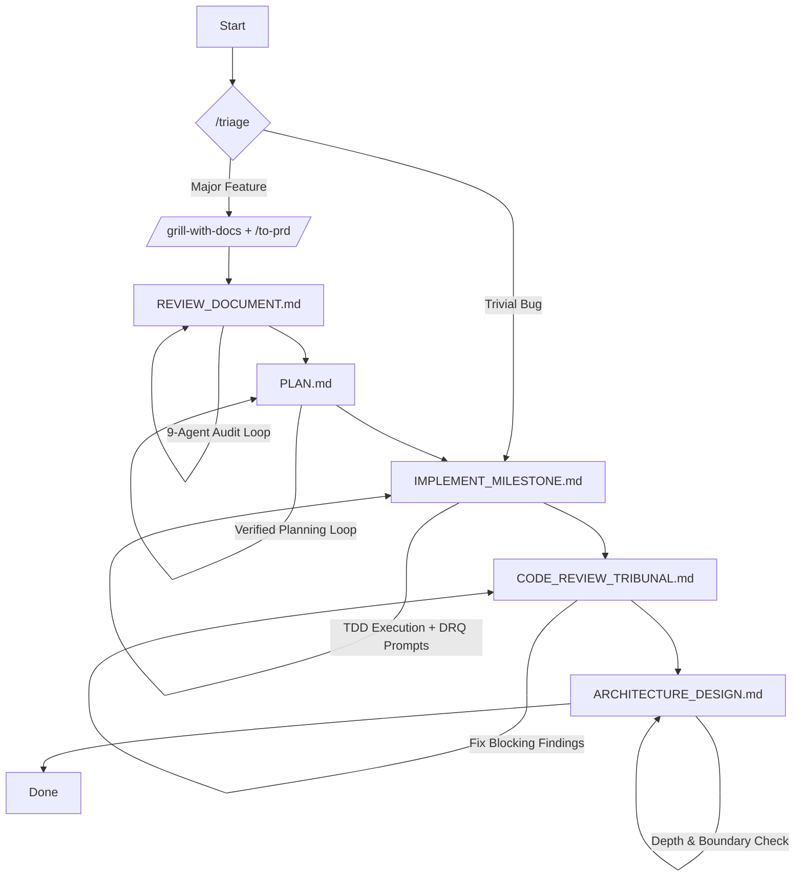

# Killhouse

> A rigorous, unforgiving AI pipeline where code is planned, tested, and audited without mercy.

Killhouse is an orchestration hub for AI coding agents. It solves "Skill Hell" and context bloat by utilizing **Delegated Orchestration**.

Instead of loading massive prompts into your main agent session—which burns tokens and degrades reasoning—Killhouse separates the *triggers* from the *payloads*. Lightweight skills act as pointers in your main chat, spawning independent, heavy subagents to handle rigorous Software Development Life Cycle (SDLC) loops.

## The Architecture

```text
killhouse/
├── skills/       # Pointers: Ultra-lightweight triggers for the main agent
├── loops/        # Payloads: Heavy, multi-agent markdown instructions
└── lib/          # Submodules: Executable code dependencies (e.g., Red Queen)
```

## The Pipeline

Killhouse enforces a strict, multi-stage gauntlet for feature development. For trivial tasks, the pipeline routes directly to execution. For major features, it follows this exact flow:



1. **Triage** (`skills/triage.md`): Determines task complexity.
2. **Discovery** (`skills/grill-with-docs.md` and `skills/to-prd.md`): Establishes the domain model and synthesizes the Product Requirements Document (PRD).
3. **Spec Audit** (`loops/REVIEW_DOCUMENT.md`): A 9-subagent loop that computes arithmetic, checks assumptions, and enforces narrative flow until the PRD reaches convergence.
4. **Planning** (`loops/PLAN.md`): Does not write code. Generates an `implementation-plan.md` with traceability matrices and falsifiable terminal gates.
5. **Execution** (`loops/IMPLEMENT_MILESTONE.md`): TDD-driven execution of the plan's vertical slices.
6. **Code Review** (`loops/CODE_REVIEW_TRIBUNAL.md`): A multi-agent gatekeeper routing files to specialists—Security, Language, and Tests—to converge on a `PASS` verdict.
7. **Architecture Review** (`loops/ARCHITECTURE_DESIGN.md`): The final health check to eliminate shallow modules, leaky boundaries, and domain-language disconnects.

## Installation

Because Killhouse relies on executable submodules like the Digital Red Queen (`redqueen`), you must clone it recursively.

```bash
# Clone the repository and fetch all submodules
git clone --recursive https://github.com/yourusername/killhouse.git

# Initialize the Python environment for executable dependencies
cd killhouse/lib/redqueen
uv sync
```

## Usage

Point your terminal-based agent to the `skills/` directory.

To start a new project, major feature, or workflow-routing request:

```text
> /ask-kh I want to build a new feature.
```

The agent will parse `skills/ask-kh.md` for minimal context cost and instruct you to begin with `/grill-with-docs`, launching the pipeline.

## Operating Principles

- **Single Source of Truth:** Never duplicate reference material. If a template is needed, hide it behind a context pointer.
- **No No-Ops:** Every instruction must explicitly alter agent behavior.
- **Strict Leading Words:** Use dense, predictable vocabulary—for example, "vertical slice"—to steer agent reasoning traces.
- **Falsifiable Gates:** A gate that cannot be proven to fail at baseline is documentation, not a gate.
