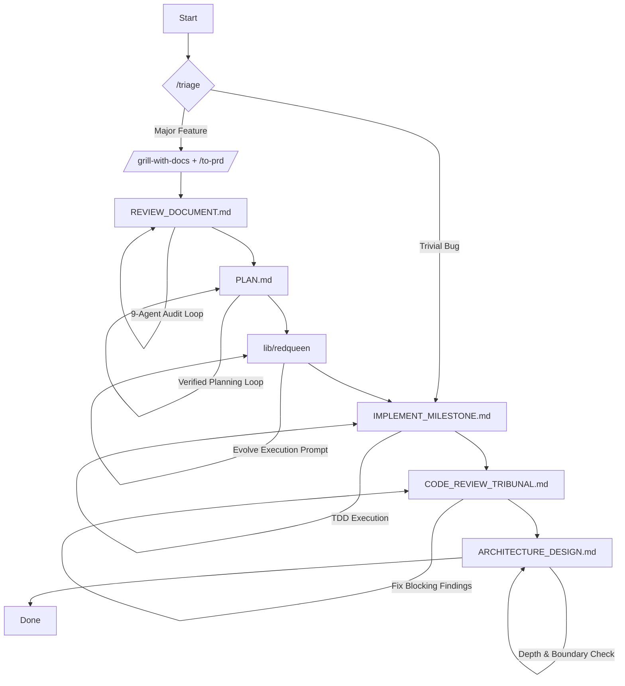

# Killhouse

> A rigorous, unforgiving AI pipeline where code is planned, tested, and audited without mercy.

Killhouse is an orchestration hub for AI coding agents. It solves "Skill Hell" and context bloat by utilizing **Delegated Orchestration**.

Instead of loading massive prompts into your main agent session—which burns tokens and degrades reasoning—Killhouse separates the *triggers* from the *payloads*. Lightweight skills act as pointers in your main chat, spawning independent, heavy subagents to handle rigorous Software Development Life Cycle (SDLC) loops.

## Quickstart

Requires [Claude Code](https://docs.claude.com/en/docs/claude-code) v2.1+.

**The lazy way — let an agent do it.** In Claude Code, just say:

```text
> install killhouse from github.com/christophergutierrez/killhouse
```

Add "with redqueen" to include the prompt-evolution engine. The agent runs the `claude plugin` CLI for you.

**The fastest path — install it yourself (no clone needed).** In a terminal:

```bash
claude plugin marketplace add christophergutierrez/killhouse
claude plugin install killhouse@killhouse
```

Then start a fresh Claude Code session (skills activate next session) and kick off the pipeline:

```text
> /ask-kh I want to build a new feature.
```

**Optional — add redqueen (the prompt-evolution engine).** Skip this to just try the pipeline; the
"evolve execution prompt" stage auto-degrades to a plain prompt when redqueen isn't present. Requires
[`uv`](https://docs.astral.sh/uv/):

```bash
git clone --recursive https://github.com/christophergutierrez/killhouse.git
cd killhouse/lib/redqueen && uv sync && cd ../..

# prove it works offline (mock fitness is 0.0 by design)
bin/evolve_exec_prompt.py --mock --rounds 2 --iterations 3 --init-random 2 --batch 2 \
  --out runs/exec --prompt-out redqueen-exec-prompt.md
```

For a *meaningful* evolved prompt, point it at a local model (`OPENAI_BASE_URL` + `DRQ_MODEL`) and run
without `--mock`. To remove Killhouse later: `claude plugin uninstall killhouse`.

## The Architecture

```text
killhouse/
├── skills/       # Pointers: Ultra-lightweight triggers for the main agent
├── loops/        # Payloads: Heavy, multi-agent markdown instructions
└── lib/          # Submodules: Executable code dependencies (e.g., Red Queen)
```

## The Pipeline

Killhouse enforces a strict, multi-stage gauntlet for feature development. For trivial tasks, the pipeline routes directly to execution. For major features, it follows this exact flow:



1. **Triage** (`skills/triage/SKILL.md`): Determines task complexity and routes trivial vs. major.
2. **Discovery** (`skills/grill-with-docs/SKILL.md` and `skills/to-prd/SKILL.md`): Establishes the domain model and synthesizes the Product Requirements Document (PRD).
3. **Spec Audit** (`loops/REVIEW_DOCUMENT.md`): A 9-subagent loop that computes arithmetic, checks assumptions, and enforces narrative flow until the PRD reaches convergence.
4. **Planning** (`loops/PLAN.md`): Does not write code. Generates an `implementation-plan.md` with traceability matrices and falsifiable terminal gates.
5. **Prompt Evolution** (`lib/redqueen`): The Digital Red Queen evolves the execution prompt before implementation begins.
6. **Execution** (`loops/IMPLEMENT_MILESTONE.md`): TDD-driven execution of the plan's vertical slices.
7. **Code Review** (`loops/CODE_REVIEW_TRIBUNAL.md`): A multi-agent gatekeeper routing files to specialists—Language, Security, Tests, Docs, and a Ponytail simplification reviewer—synthesized by an architect to converge on a `PASS` verdict.
8. **Architecture Review** (`loops/ARCHITECTURE_DESIGN.md`): The final health check to eliminate shallow modules, leaky boundaries, and domain-language disconnects.

## Usage

Once the plugin is installed (see [Quickstart](#quickstart)), start any new project, major feature, or workflow-routing request with:

```text
> /ask-kh I want to build a new feature.
```

The agent will parse `skills/ask-kh/SKILL.md` for minimal context cost and instruct you to begin with `/grill-with-docs`, launching the pipeline.

## Operating Principles

- **Single Source of Truth:** Never duplicate reference material. If a template is needed, hide it behind a context pointer.
- **No No-Ops:** Every instruction must explicitly alter agent behavior.
- **Strict Leading Words:** Use dense, predictable vocabulary—for example, "vertical slice"—to steer agent reasoning traces.
- **Falsifiable Gates:** A gate that cannot be proven to fail at baseline is documentation, not a gate.

## Credits

A big thank-you to [Matt Pocock](https://github.com/mattpocock) — the front end of this pipeline stands on his work. The grilling, domain-modeling, and PRD skills come straight from his excellent [mattpocock/skills](https://github.com/mattpocock/skills) repo; Killhouse just wraps them in a heavier, more opinionated gauntlet. Go read the original — it's worth your time.

- The front-end skills (`triage`, `grill-with-docs`, `grilling`, `domain-modeling`, `to-prd`) are vendored from [mattpocock/skills](https://github.com/mattpocock/skills) (MIT) and customized for this pipeline. See [`skills/NOTICE.md`](./skills/NOTICE.md).
- The Digital Red Queen (`lib/redqueen`) is included as a submodule from [christophergutierrez/redqueen](https://github.com/christophergutierrez/redqueen).
